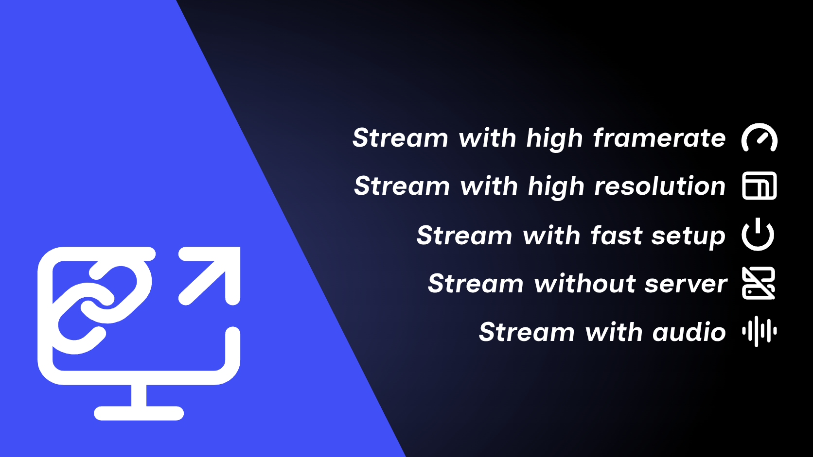

# StreamRoom

High-performance screen and audio sharing via SolidJS, WebCodecs & WebRTC/WebSocket.

StreamRoom allows users to create virtual rooms to watch real-time broadcasts with ultra-low latency, leveraging hardware acceleration (FFmpeg/WebCodecs) and Supabase signaling.

---

## 🚀 Getting Started

### 1. Requirements
- **Node.js**: Version 22 or higher (for viewer web app UI).
- **FFmpeg**: Required only on the broadcasting machine for the Python Streamer.

### 2. Dependency Installation
```bash
npm install
```

---

## 🛠️ Main Commands

| Command | Description |
|---|---|
| `npm run dev` | Launches the SolidJS Vite development server for the viewer interface. |
| `npm run build` | Compiles the viewer application for production (generates static files in `dist/`). |
| `npm run stream` | Launches the Python Streamer (GTK4 UI / CLI) for hardware-accelerated broadcast. |
| `npm run update-discord` | Updates activity URL mappings in Discord Developer Portal (optional). |
| `npm test` | Runs unit test suite (Vitest). |
| `npm run lint` | Runs code linter check (ESLint). |

---

## 🖥️ Streamer (Python Hardware Streamer)

To stream at high framerates (60 FPS) and high resolutions without overloading the browser, use the standalone streamer:

```bash
npm run stream
```

### Streamer Features:
- GTK4 graphical interface for window/screen and audio source selection.
- GPU acceleration support (`NVENC`, `VAAPI`, `QSV`).
- System audio capture via PipeWire / PulseAudio.
- Built-in Cloudflare Tunnel for direct WebSocket/WebCodecs video delivery.

---

## 📜 Legal Pages & Documentation
- **Privacy Policy**: Accessible at `/privacy-policy`
- **Terms of Service**: Accessible at `/terms-of-service`
- [how-it-works.md](docs/how-it-works.md): Technical explanation of WebCodecs & Supabase architecture.
- [vps.md](docs/vps.md): Guide for hosting static assets on a VPS or web server.
